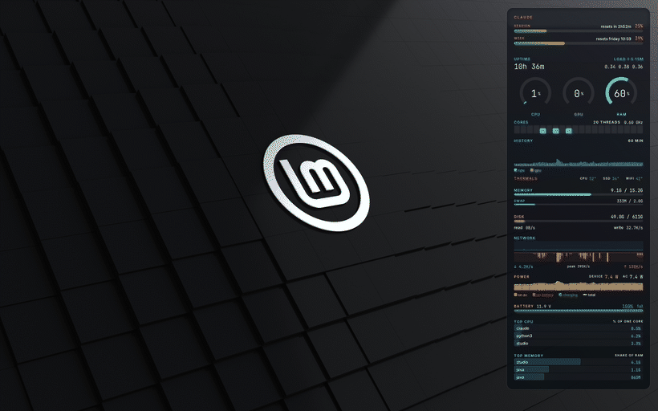
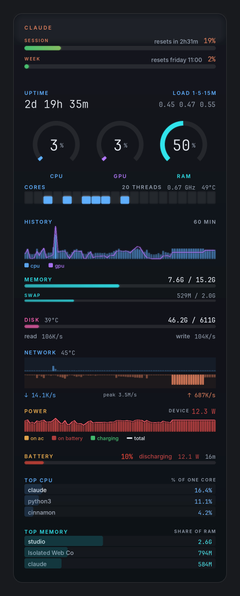
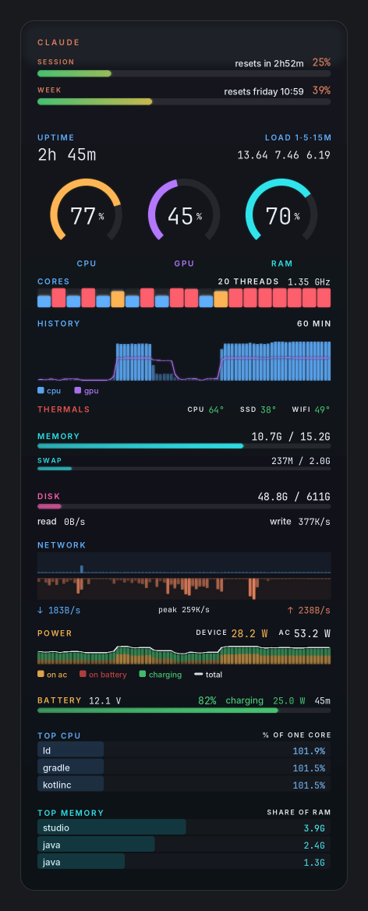
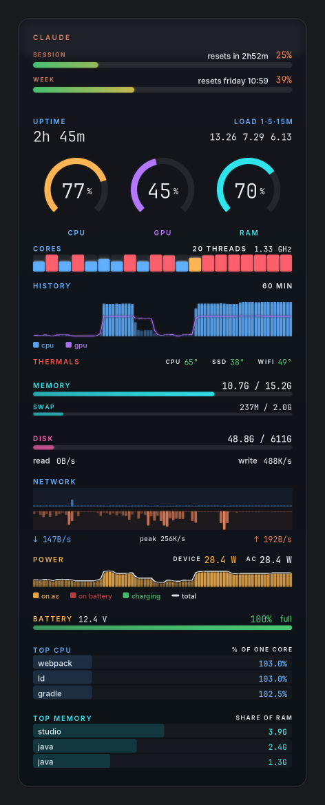
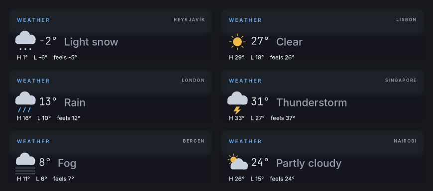

# linux-mint-hud

A system panel that lives on the desktop. One Python process reads every
metric from `/proc` and `/sys`, draws the whole panel with Pillow, and paints
it into its own desktop window through GTK and cairo. It sits below your
windows, on every workspace, and clicks fall straight through it to the
desktop underneath. The top slot shows Claude plan quota, weather, or
alternates between the two.



## What it shows

- **Claude plan quota** — session and weekly usage, read from the endpoint
  claude.ai's own settings page uses. The session window counts down; the
  weekly one names a weekday and time.
- **Weather** shares that top slot. With a Claude subscription the slot
  alternates between quota and current weather every few seconds; without one
  (no subscription, a lapsed login, no Claude Code at all) it just shows
  weather — a hand-drawn icon for the sky, the temperature large, and the
  day's min, max and feels-like, each tinted by how cold or hot it is. From
  open-meteo, no API key; set no location and the slot is simply empty.
- **Uptime and load** — the 1, 5 and 15 minute averages, coloured against the
  thread count so they only light up when work is actually queuing.
- **CPU, GPU and RAM** — ring gauges, a strip with one column per logical
  core, and an hour-long history where the GPU rides along as a line over the
  CPU columns.
- **Thermals** — the CPU package, SSD and wifi-radio temperatures on one line,
  each on a green-to-red gradient, so a cool part reads calm and a hot one
  stands out.
- **Memory, swap and disk** usage.
- **Network** — one chart, download above the axis and upload below it.
- **Power** — what the machine draws and, while charging, what the wall
  delivers on top of that, coloured by where the energy is coming from. On
  mains it reads full system power from Intel RAPL when that is permitted (see
  the installer); otherwise it falls back to what the battery reports. The
  battery line carries its charge, direction and terminal voltage.
- **Top three processes** by CPU and by memory.

## Power states

The power section changes colour with where the energy is coming from, which is
most of what there is to watch. On battery it is red and shows only what the
machine draws; on mains it splits consumption from the charge going into the
pack, and reads full system power from RAPL where that is permitted.

<table>
<tr>
<td width="33%"></td>
<td width="33%"></td>
<td width="33%"></td>
</tr>
<tr>
<td valign="top"><b>On battery, 10%.</b> The bar is red, and the power header shows only what the machine draws — there is no wall to measure.</td>
<td valign="top"><b>Charging, 82%.</b> Amber consumption with the charge into the pack stacked in green, and just enough of the earlier on-battery period (red) left to show the switch.</td>
<td valign="top"><b>Full, under load.</b> Twenty cores pegged: the gauge and per-core strip go red, the history fills, and the CPU runs hot. The battery bar is green now that it is topped up.</td>
</tr>
</table>

## How it's built

There is no separate widget engine. `hud.py` is the whole thing: it samples
the metrics, lays the panel out top to bottom as a single running cursor,
renders it with Pillow, and hands the pixels to a GTK window via cairo. Rates
are deltas against the previous frame, so there is no sampling delay. The panel
grows to sit at an equal margin on all four sides, spreading any spare height
across the gaps between sections rather than leaving a hole at the bottom.

| | |
|---|---|
| `hud.py` | everything: metrics, layout, rendering, the window |
| `install.sh` | guided installer — dependencies, fonts, autostart |
| `bootstrap.sh` | clone + install, for the one-liner |
| `claude_quota.py` | Claude plan quota from claude.ai |
| `weather.py` | current weather from open-meteo (reads `weather.json`) |
| `browser_cookie.py` | reads the session cookie from the running browser — Firefox first, then Chromium |
| `chromium_cookies.py` | the Chromium half: decrypts its cookie store via the desktop keyring |
| `99-rapl-psys.rules` | optional udev rule for the system-power reading |
| `shot.py` | renders one frame to `docs/` for the screenshots here |

It adapts to the hardware it finds. CPU temperature comes from Intel
`coretemp`, AMD `k10temp` or a thermal zone; GPU load from Intel/AMD DRM
counters or NVIDIA's `nvidia-smi`; system power from whichever RAPL domain is
readable. What a given machine can't report simply drops out — a desktop's
missing battery, a GPU with no readable utilisation, temperatures a board
doesn't expose — rather than showing dead zeros.

Written for Linux Mint (Cinnamon). It should work on other X11 desktops but
has not been tested there.

## On any desktop

The panel is translucent dark glass, so it settles onto whatever wallpaper is
behind it.

<table>
<tr>
<td width="50%"></td>
<td width="50%"></td>
</tr>
<tr>
<td width="50%"></td>
<td width="50%"></td>
</tr>
</table>

## Installing

```
bash <(curl -fsSL https://raw.githubusercontent.com/Versifft/linux-mint-hud/main/bootstrap.sh)
```

That clones the repo to `~/.config/mint-hud` and runs the guided installer,
which asks before each step, skips what is already present, and is safe to
re-run.

Or clone it yourself and run the installer:

```
git clone https://github.com/Versifft/linux-mint-hud.git ~/.config/mint-hud
~/.config/mint-hud/install.sh
```

### By hand

The core dependencies, all in the Mint repositories:

```
sudo apt install python3-pil python3-gi python3-gi-cairo python3-cairo
```

`python3-cryptography` and `gir1.2-secret-1` in addition let the Claude section
read a cookie from a Chromium-family browser; skip them if you use Firefox.
Fonts are optional — it falls back to DejaVu and just looks plainer. Inter and
JetBrains Mono install per-user, no root:

```
apt-get download fonts-inter fonts-jetbrains-mono
for d in *.deb; do dpkg-deb -x "$d" x; done
mkdir -p ~/.local/share/fonts
find x -name '*.[ot]tf' -exec cp {} ~/.local/share/fonts/ \;
fc-cache -f ~/.local/share/fonts
```

Then run `~/.config/mint-hud/hud.py`, and for autostart drop a `.desktop` file
in `~/.config/autostart/` pointing at it with a few seconds of
`X-GNOME-Autostart-Delay`.

## The Claude quota cookie

The Claude section talks to a private claude.ai endpoint that authenticates
with your browser session cookie. `browser_cookie.py` reads it straight out of
the running browser each time, so it stays current on its own as long as you
are logged in — Firefox and its forks, or Chromium-family browsers (Chrome,
Brave, Edge). Nothing is stored beyond a cached copy at
`~/.config/mint-hud/.claude_web_cookie` (mode 600, never committed).

If your browser isn't supported, or the section shows a login message it
shouldn't, you can drop a cookie in by hand. In the browser's dev tools,
export a HAR of any request to `claude.ai/api/.../usage`, save it to
`~/Downloads`, and run:

```
python3 -c "
import json, os, glob
hars = sorted(glob.glob(os.path.expanduser('~/Downloads/*.har')), key=os.path.getmtime)
p = hars[-1]
with open(p) as f:
    d = json.load(f)
e = next(x for x in d['log']['entries'] if x['request']['url'].endswith('/usage'))
cookie = next(h['value'] for h in e['request']['headers'] if h['name'].lower() == 'cookie')
out = os.path.expanduser('~/.config/mint-hud/.claude_web_cookie')
with open(out, 'w') as f:
    f.write(cookie.strip() + '\n')
os.chmod(out, 0o600)
print('saved from', p, '- length:', len(cookie))
"
```

Delete the `.har` afterwards — it contains your full session cookie in plain
text.

## Weather



*(example locations — the icon follows the WMO weather code)*

The installer offers to set a location; otherwise create `weather.json` in the
repo yourself:

```
{"lat": 47.01, "lon": 7.69, "name": "Lützelflüh"}
```

open-meteo needs no key, and once the coordinates are set nothing identifying
is sent — no IP geolocation. The file is gitignored, so your location stays
local. With no `weather.json` the weather slot is simply not shown.

## Running it

```
~/.config/mint-hud/hud.py         # start the panel
~/.config/mint-hud/hud.py --png   # render one frame to cache/hud.png
pkill -f "hud[.]py$"             # stop it
```

Note the `[.]` in that pattern — plain `hud.py` also matches the shell you type
it in, and `pkill -f` will happily kill your own terminal. Failures land in
`cache/hud.log`.

## License

MIT — use it, change it, ship it, no warranty. See [LICENSE](LICENSE).
